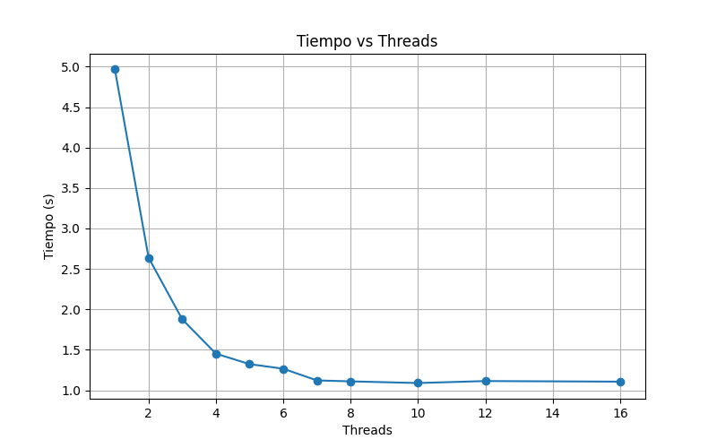
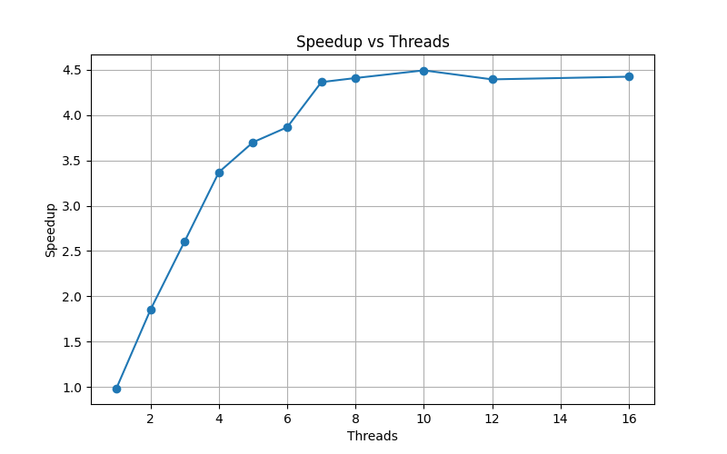

# Proyecto Final — Programación Paralela y Concurrente

## Descripción

Este proyecto implementa la generación y procesamiento del fractal de Mandelbrot utilizando programación paralela con OpenMP en C++.

El objetivo principal fue analizar distintas técnicas de optimización paralela y medir su impacto en el rendimiento sobre arquitectura Apple Silicon M1.

El proyecto incluye:

- Implementación secuencial
- Paralelización con OpenMP
- Evaluación de schedulers
- Histogramas paralelos
- Sincronización con atomic
- Histogramas locales
- Vectorización SIMD
- Afinidad de hilos
- Benchmarks automáticos
- Speedup y eficiencia paralela
- Gráficas de rendimiento

---

# Tecnologías utilizadas

- C++
- OpenMP
- Python
- Matplotlib
- Pandas

---

# Arquitectura utilizada

- Apple Silicon M1
- macOS
- ARM NEON SIMD

---

# Estructura del proyecto

```text
.
├── docs/
├── images/
├── results/
├── scripts/
├── src/
│   ├── main_secuencial.cpp
│   ├── main_openmp.cpp
│   ├── main_schedulers.cpp
│   ├── main_histogram.cpp
│   └── main_simd.cpp
└── README.md
```

---

# Compilación

## Versión OpenMP SIMD

```bash
clang++ src/main_simd.cpp \
-Xpreprocessor -fopenmp \
-I/opt/homebrew/opt/libomp/include \
-L/opt/homebrew/opt/libomp/lib \
-lomp \
-O3 \
-std=c++17 \
-o simd
```

---

# Ejecución

```bash
export OMP_NUM_THREADS=8
export OMP_SCHEDULE="dynamic,8"

./simd
```

---

# Resultados principales

## Tiempo secuencial

```text
4.89962 segundos
```

## Mejor tiempo paralelo

```text
1.09026 segundos
```

## Mejor scheduler

```text
dynamic,8
```

## Speedup máximo

```text
4.49x
```

## Mejor número de hilos

```text
10 hilos
```

## Eficiencia paralela

```text
44.9%
```

---

# Vectorización SIMD

Se utilizó:

```cpp
#pragma omp simd
```

El compilador confirmó la vectorización automática:

```text
vectorized loop (vectorization width: 16)
```

---

# Comparación de histogramas

| Método | Tiempo |
|---|---|
| Atomic | 0.207232 s |
| Histogramas locales | 0.00298762 s |

Los histogramas locales redujeron significativamente la contención y el overhead de sincronización.

---

# Afinidad de hilos

Se realizaron pruebas utilizando:

```bash
OMP_PROC_BIND=true
OMP_PLACES=cores
```

La afinidad mostró ligeras mejoras de rendimiento al reducir migraciones de hilos.

---

# Benchmarks automáticos

## Ejecutar benchmarks

```bash
./scripts/benchmark.sh
```

## Benchmark por número de hilos

```bash
./scripts/threads_benchmark.sh
```

---

# Gráficas generadas

## Tiempo vs Threads



## Speedup vs Threads



---

# Ley de Amdahl

El proyecto demuestra cómo el speedup deja de crecer linealmente debido a:

- Overhead de sincronización
- Contención de memoria
- Administración de hilos
- Parte secuencial del programa

---

# Conclusiones

Se logró acelerar significativamente la generación del fractal Mandelbrot mediante OpenMP y técnicas de optimización paralela.

Las mejores mejoras se obtuvieron mediante:

- Scheduler `dynamic,8`
- Histogramas locales
- Afinidad de hilos
- Vectorización SIMD

El proyecto demuestra conceptos importantes de:

- Programación paralela
- OpenMP
- SIMD
- Escalabilidad
- Speedup
- Eficiencia paralela
- Ley de Amdahl

---

# Autor

Denisse Valle